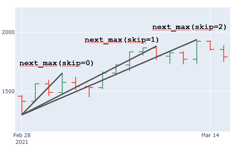

# ElliottWaveAnalyzer
First Version of an (not yet) iterative Elliott Wave scanner in financial data.

## Setup
use Python 3.11 environment and install all packages via
`pip install -r requirements.txt`

# Algorithm / Idea
The basic idea of the algorithm is to try **a lot** of combinations of possible wave
patterns for a given OHLC chart and validate each one against a given
set of rules (e.g. against an 12345 impulsive movement).

## Quickstart
Start with `example_monowave.py` to see how the basic concept (finding monowaves) works and play with the parameter `skip_n`.

Then have a look into `example_12345_impulsive_wave.py` to see how the algorithm works for finding 12345 impulsive movements.

## Helper
Use `get_data.py` script to download data directly from yahoo finance.

# Class Structure
## MonoWave
The smallest element in a chart (or a trend) is called a MonoWave: 
The impulsive movement from a given low (or high) to the next high 
(or down to the low), where each candle (exactly: high / low) 
forms a new high (or new low respectively). 

The MonoWave ends, once a candle breaks this "micro trend".

There is `MonoWaveUp` and the `MonoWaveDown`, denoting the direction of the wave.

### WaveOptions
`WaveOptions` are a set of integers denoting how many of the (local) highs or lows should be
skipped to form a MonoWave.

### Parameters
The essential idea is, that with the parameter `skip=`, smaller corrections can be skipped. In case of an upwards trend, 
e.g. `skip=2` will skip the next 2 maxima.

## WavePattern
A `WavePattern` is the chaining of e.g. in case for an Impulse 5 `MonoWaves` (alternating between up and down direction). It is initialized with a list of `MonoWave`.

## WaveRule
`WavePattern` can be validated against a set of rules. E. g. form a valid 12345 impulsive waves, certain rules have to apply for the 
monowaves, e.g. wave 3 must not be the shortest wave, top of wave 3 must be over the top of wave 1 etc. 

Own rules can be created via inheritance from the base class. There are rules
implemented for 12345 Impulse. Leading Triangle and for ABC Corrections.

To create an own rule, the `.set_conditions()` method has to be implemented for every inherited rule. The method has a `dict`, having
arbitrarily named keys, having `{'waves': list 'function': ..., 'message': ...}` as value.

For `waves` you pass a list of waves which are used to validate a specific rule, e.g. `[wave1, wave2]`.

For `function` you use a `lambda` function to check, e.g. `lambda wave1, wave2: wave2.low > wave1.low`

For `message` you enter a message to display (in case `WavePattern(..., verbose=True)` is set).

Note that only if all rules in the `conditions` are `True` the whole `WaveRule` is valid.

### Check WavePattern against Rule
Once you have a `WavePattern` (chaining of 5 `MonoWave` for an impulse or 3 `MonoWave` for a correction)
 You can check against a `WaveRule` via the `.check_rule(waverule: WaveRule)` method.

## WaveCycle
A `WaveCycle` is the combination of an impulsive (12345) and a corrective (ABC) movement.
Not working atm.

## WaveAnalyzer
Is used to find impulsive and corrective movements.
Not working atm.

### WaveOptionsGenerator
There are three `WaveOptionsGenerators` available at the moment to fit the needs for creating
tuples of 2, 3 and 5 integers (for a 12 `TDWave`, an ABC `Correction` and a 12345 `Impulse`).

The generators already remove invalid combinations, e.g. [1,2,0,4,5], as after selecting the next minimum (3rd index is 0), for the 4th and 5th wave skipping is not allowed.

As unordered sets are used, the generators have the `.options_sorted` property to go from low numbers to high ones. This means that
first, the shortest (time wise) movements will be found.

## Helpers
Contains some plotting functions to plot a `MonoWave` (a single movement), a `WavePattern` (e.g. 12345 or ABC) and a `WaveCycle` (12345-ABC).

# Plotting
For different models there are plotting functions. E.g. use `plot_monowave` to plot a `MonoWave` instance or `plot_pattern` for a `WavePattern`.
